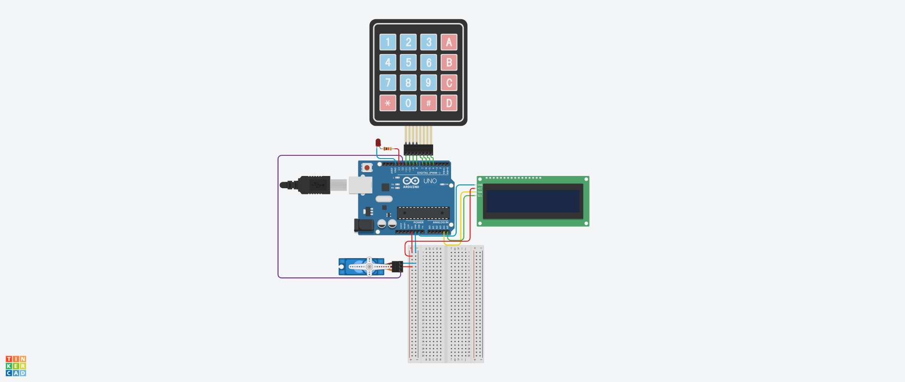

# Arduino Uno R3 Door Lock System

This project demonstrates a simple yet effective door lock system built with an Arduino Uno R3, a 4x4 keypad for user input, a 16x2 I2C LCD for visual feedback, and a servo motor to act as the locking mechanism. The system allows users to enter a pin code via the keypad to unlock the door, providing a practical introduction to integrating various electronic components and coding them to work together.

## Live preview: [Tinkercad simulation](https://www.tinkercad.com/things/l2eZooeP3yq-door-lock-system)

## Features

- **Keypad Input**: Enter the pin code using a 4x4 keypad.
- **LCD Feedback**: Displays messages to the user on a 16x2 I2C LCD screen.
- **Servo Motor**: Controls the locking mechanism.
- **LED Indicator**: Lights up when an incorrect pin code is entered.

## Components

- **Arduino Uno R3**: The microcontroller used to control the system.
- **4x4 Keypad**: Used for entering the pin code.
- **16x2 I2C LCD**: Displays messages such as welcome and error notifications.
- **Servo Motor**: Acts as the physical lock.
- **LED**: Indicates incorrect pin code entry.
- **Jumper Wires**: Used to connect components.

## Circuit Diagram

